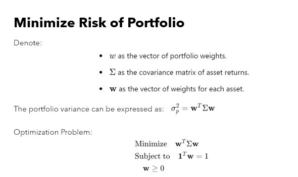
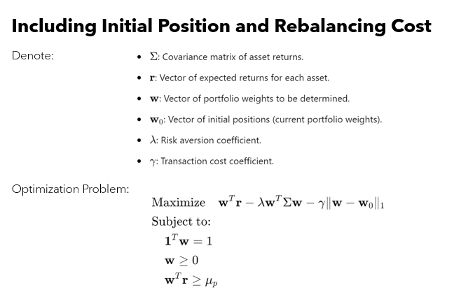

# **Portfolio-Optimization-with-PCA-Enhanced-Covariance-and-Transaction-Costs**
**Developed and deployed an active equity portfolio solution utilizing Principal Component Analysis for high-precision covariance estimation and transaction cost modeling. Achieved risk-adjusted, stable allocations with significant improvement in portfolio return and cost efficiency.**

#  **Evaluated Risk Measures for S&P 500 and 10 other stocks**
Below are functions accepting start_date and end_date as input parameters to evaluate this different risk measures from 2020-01-01
to 2023-12-31. 
---

## **Performance Metrics Computed in the Project**

* **Average Daily Return:** 
  Computes the mean daily return of each asset over the selected analysis period.

* **Daily Volatility (Standard Deviation):** 
  Measures the standard deviation of daily returns, capturing the asset's risk level.

* **Maximum Drawdown:** 
  Calculates the largest peak-to-trough decline within the specified period, indicating downside risk.

* **Tracking Error (vs. S&P 500):** 
  Computes the deviation of each stock’s returns from the S&P 500 benchmark.

* **Sharpe Ratio:**
  Evaluates risk-adjusted performance using the average daily return and daily volatility.

* **Value at Risk (VaR):**
  Expected maximum loss at a given confidence level.
  
* **Compute Conditional Value at Risk (CVaR / Expected Shortfall):**
  Average loss beyond the VaR threshold. 

  

  

# **Implement Regression of CAPM**

 * **Step 1:** **Collect Data in a given time period for both individual stocks and the S&P 500**.
 * **Step 2:** **Calculate Excess Returns for each asset over the risk-free rate.**
 * **Step 3:** **Regress Excess Return of each stock on the Excess Return of the S&P 500 to estimate market beta.**
   

  

# **1. Minimizing Portfolio Risk**
* **Estimate covariance matrix of the 10 chosen stocks**
* **Build a minimized risk portfolio using your picked stocks**
  

  

# **2. Model Building Markowitz Portfolio**
* **We use risk aversion levels in your portfolio optimization and observe how the parameter changes your optimal holdings**
* **We include initial cash in our Portfolio**
  

  

# **3. Building Markowitz Portfolio**
* **We add transaction cost term to Markowitz Portfolio model**
* **We use 0 as initial position or use a random vector initial position.**
* **For transaction cost coefficient, we use 2bps of trade size in USD.**
* **we multiply the risk/return term by holding period to convert unit to USD, so that unit of all terms in the objective function is consistent with each other**.

  

# **4. Active Asset Management:Building an active portfolio**
  
* **PCA to extract systematic risk for improved covariance estimation**

* **Integration of asset-specific idiosyncratic risk for robust allocation**

* **CVXPY-based constrained optimization, balancing expected return, variance, and trading costs**

# **Main Results & Data Highlights**
* **Present actionable quantitative outcomes up front**

* **Portfolio of top S&P 500 equities—optimized for 252 trading days, starting from $1 million capital**

* **Transaction cost per rebalance: $200.00​**

* **Projected annualized return: $105,021.92​**

* **Weights and trades explicitly shown for transparency**

# **Metric	Value**
* **Holding Period	252 days**
* **Initial Investment	$1,000,000**
* **Expected Return	$105,021.92**
* **Transaction Cost	$200.00**

# **Industry-Relevant Skills**
List technologies and methodologies as both badges and keywords:

* **Python, Pandas, NumPy, yFinance API**

* **PCA, Portfolio Theory, Risk Metrics (VaR, CVaR, Tracking Error)**

* **CVXPY, Quadratic Programming, Data Visualization**

* **Financial Modeling Best Practices, Transaction Cost Analysis**

# **Impact & What Makes It Stand Out**
* **“Brings together state-of-the-art quantitative risk modeling and practical execution constraints in a scalable framework applicable to real trading environments.”**

* **“Demonstrated robust estimation under high-dimensionality, balancing theoretical rigor with realistic implementation.”**

# **How to Run & Explore**

* **Requirements.txt (CVXPY, scikit-learn, yFinance)**

